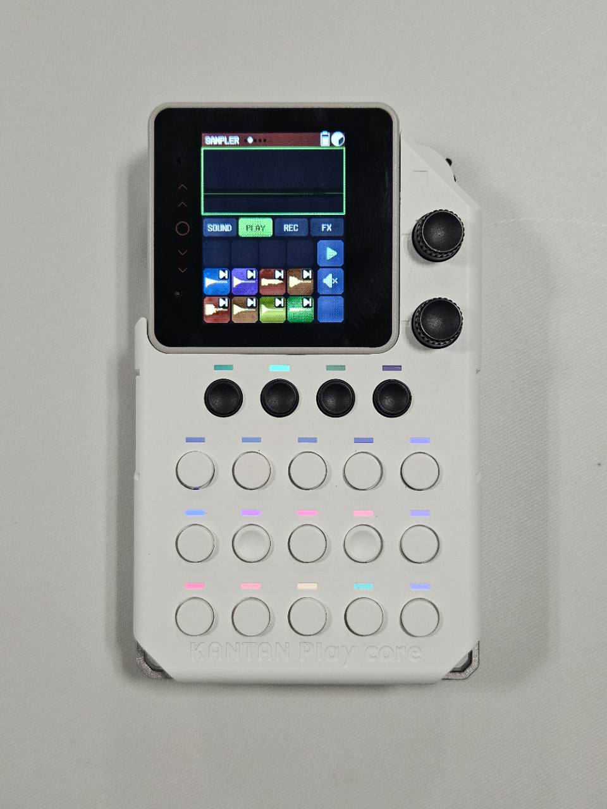

# 画面とボタン

最初は、すべての表示を覚える必要はありません。まずは「現在のパート」「現在のモード」「Pad」「Fn」の4か所を確認できれば操作できます。

{ .device-photo loading=lazy }

## 画面の見方

### 1. 現在のパート

画面左上の`SAMPLER`は、現在選んでいるパートです。本機には次の5パートがあります。

- `BEAT`
- `SAMPLER`
- `BASS`
- `MELODY`
- `CHORD`

最初のチュートリアルでは`SAMPLER`を使います。

### 2. 演奏表示エリア

画面上側の大きな領域です。PLAY、REC、編集内容に応じて、波形やLoop上の演奏位置などを表示します。

### 3. 4つのモード

画面中央の`SOUND / PLAY / REC / FX`は、同じパートで何をするかを切り替えます。

| モード | 役割 |
|---|---|
| `SOUND` | 音源を選ぶ、録音する、編集する |
| `PLAY` | Sampleを自由に演奏する |
| `REC` | 演奏を記録してLoopにする |
| `FX` | 再生音へエフェクトをかける |

本体画面の下にある4つの黒いボタンが、同じ並びのモードボタンです。選択中のモードは明るく表示されます。

### 4. Sample PadとFn表示

写真では、8つの初期Sampleが色付きのタイルとして表示されています。右側の縦列は、再生やMuteなどを行うFnの役割を示します。

Fnの役割はモードや画面によって変わります。その時に使える操作を画面のアイコンで確認してください。

## 物理ボタンの並び

大きな白いボタンは5列x3段です。

- 左4列：12個の演奏用Pad
- 右端列：上から`Fn1`、`Fn2`、`Fn3`

初期状態では、上2段の8つのSampler PadにSampleが入り、下段の4つは空です。

## 右側のダイヤル

- 上のダイヤルを回す：全体の音量
- 上のダイヤルを押す：すべての音とLoop再生を停止
- 下のダイヤルを回す：通常画面ではパートを選ぶ。メニューや編集画面では項目や値を動かす

!!! tip
    操作中に分からなくなったり音が止まらなくなったりした場合は、まず上のダイヤルを押してください。
